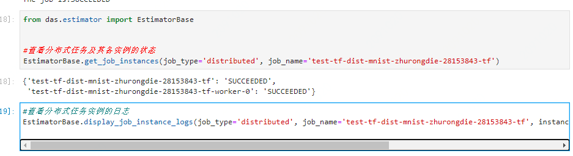

1. 普通训练任务（非分布式）
   1. 开通权限

   2. 创建环境：选择服务器、镜像（系统/自定义）、开发环境、集市

      创建完成后控制台界面显示如下：

      

      - 选择服务器资源时进行提示按需选择，长时间不用的资源将被清除，**可以提供资源使用说明来帮助用户理解（如什么样的任务适合使用什么配置的资源）**
      - 提示使用GPU资源时可以通过DAS API进行调用来提交训练任务，表明支持使用GPU，**此处可以将GPU资源显示在此控制台界面**
      - 镜像选择支持系统镜像与自定义镜像选择
      - 支持服务器性能查看服务
      - ==按照等级分配GPU资源==（等级如何进行划分，划分标准是什么）
      - ==需要使用大数据平台的资源时可以进行申请==（使用哪些资源，对任务训练有什么帮助）

   3. 编程开发环境：jupyterlab

   4. DAS API：帮助提交端到端的数据处理、模型训练、模型部署和在线预测任务，对于需要GPU的模型训练，必须要通过DAS API提交任务（不需要使用GPU资源的模型训练如下，可以不通过API）
      1. 创建开发环境

      2. notebook环境

         - 目前看来只能在jupyterlab环境中进行模型训练系列操作，这样对普通用户的要求可能高一点，**可以提供jupyterlab使用说明来帮助用户熟练使用该环境，减少用户对产品的排斥**

      3. 训练模型
         1. 编写entrypoint文件（entrypoint文件是实际上要跑的训练代码，作为das api调用的入口文件）
         2. 加载数据集
            - 数据集加载支持直接从公共资源池中下载，**对于常见数据集或者demo中的数据集可以放到公共资源池中，方便用户直接获取**
            - 加载数据集也包括其他方式，除了将数据集事先放置在公共资源池中，还可以直接从本地上传小文件到开发换进或者将大文件通过oss数据交互上传到自建的存储磁盘中（==这三种数据上传下载方式各有什么使用场景，为什么==）
         3. 调用das api进行训练
         4. 查看任务状态和日志

      4. 部署模型

         - 模型部署默认部署到测试环境且一周后自动清理（==测试环境，清理的原因是为了释放资源吗，清理前需要提醒用户吗（提供告警机制）==）

      5. 调用模型进行预测/推理

         

2. 分布式训练任务（与普通训练任务相比只在DAS API训练时有差异）
   1. 编写entrypoint文件（单机训练文件中加入集群配置）
   
   2. 加载数据集（本地上传）
   
   3. 设置分布式训练参数，调用DAS API进行训练
   
      ring-all-reduce策略
   
      
   
   4. 任务状态及日志查看
   
   5. 分布式任务管理面板（日志查看、性能监控及删除）
      - 使用DAS API提交训练任务的前提是需要先在单机代码中进行集群配置
      - 设定分布式模式是ps-worker时，不创建chief的原因是默认worker0为chief（采用图间复制训练时，可以手动指定chief，也可以采用默认模式，==两种方法的效果一样==，因此不需要在控制台界面指定chief）
      - **控制台界面提供框架选择框、版本选择框、分布式选择框、分布式策略选择框及当使用GPU时的卡数选择框**
      - 控制台界面查看训练任务时分为训练任务、分布式训练任务及调度任务三类，且不同种类任务支持通过任务ID/名称进行搜索，避免用户查找之前创建的任务时不方便
      - 未提供Tensorboard可视化服务，不能帮助理解模型训练过程

### 总结

1. 平台优点
   1. 数据管理模块
      1. 提供三种数据获取或上传方法
         1. 大数据集市数据获取：需要拥有大数据集市权限
         2. 线上服务器数据上传及获取：分为公共资源池及私有资源池，公共资源池访问无限制且使用简单，私有资源池用于保密内容且使用困难
         3. 本地电脑数据上传：小文件直接通过notebook中的上传功能上传至个人磁盘，大文件通过对象存储服务上传至公共资源池或私有资源池
   2. 开发环境模型训练模块
      1. 使用DAS API封装分布式训练具体实现方式，通过参数配置实现不同分布式策略下的分布式训练
      2. 支持在开发环境中进行包括训练代码修改、模型训练、日志查看、模型部署及预测/推理等一站式操作，提供交互式服务
   3. 控制台界面模块
      1. 资源管理：提示用户合理进行服务器资源选择，长期不使用的服务器资源及部署模型将被清理
      2. 任务分类管理及查找：分训练任务、分布式任务及调度任务进行分开管理，对每类任务提供查找服务，支持用户按照id或名称来查找创建完成的任务
2. 平台缺点
   1. Jupyterlab开发环境：没有针对不同框架下不同分布式策略的统一参数配置说明
   2. 控制台界面：不支持训练任务创建
3. 优点延申及缺点避免
   1. 资源管理
      1. 平台资源管理：针对服务器资源、磁盘资源进行内容说明及推荐，提示用户根据创建的任务选择合适的服务器及磁盘大小
      2. 数据管理：针对用户使用数据的私密程度提供公共资源池及私有资源池服务，支持用户从资源池获取数据及将本地数据上传到资源池
      3. 资源回收：提供告警机制，当资源长时间不使用时告知用户即将回收资源
   2. 使用场景
      1. Jupyterlab开发环境：提供使用说明文档及demo来帮助用户熟悉使用流程
      2. 控制台界面：实行任务分类及按id号或名称查找，支持界面上进行分布式训练任务创建
   3. 计算模式
      1. 支持框架：支持主流框架下不同策略的分布式训练，可以将这些框架下的分布式训练、部署、预测/推理操作统一封装在一个API中，方便用户调用
      2. 参数配置：提供不同框架下不同分布式策略的参数配置说明

