### 产品介绍

1. 使用容器进行分布式训练

   1. 只要所使用框架的分布式训练策略对应平台自定义容器的分布式训练结构（主实例，工作器和参数服务器），（如MXNet中的分布式训练使用调度器、工作器和服务器），就可以借助自定义容器使用该框架进行分布式训练
   2. 训练集群的结构
      1. 如果您使用 AI Platform Training 运行分布式训练作业，则需要在训练集群中指定多个机器（节点）。训练服务会为您指定的机器类型分配资源。给定节点上正在运行的作业称为副本。在分布式训练中，系统会根据分布式 TensorFlow 模型，为训练集群中的每个副本分配一个角色或任务：
         - **主实例工作器**：您只能将一个副本指定为主实例工作器。这项任务可管理其他任务，并报告作业的整体状态。
         - **工作器**：您可以将一个或多个副本指定为工作器。这些副本执行您在作业配置中为它们指定的工作。
         - **参数服务器**：可以将一个或多个副本指定为参数服务器。这些副本会存储模型参数，并协调工作器之间的共享模型状态。
         - **评估程序**：您可以将一个或多个副本指定为评估器。这些副本可用于评估您的模型。如果您使用的是 TensorFlow，请注意 TensorFlow 通常要求您只能使用一个评估器。
      2. 针对每个副本填充一个Cluster_Spec环境变量，以便描述整个集群

4. 训练模型具体流程

   1. 概要步骤

      1. 创建 Python 模型文件
         1. 添加代码，以从 Cloud Storage 下载您的数据供 AI Platform Training 使用
         2. 添加代码，以在 AI Platform Training 完成模型训练后，将模型导出并保存到 Cloud Storage
      2. 准备训练应用软件包
      3. 提交训练作业

   2. 具体进行（使用XGBoost进行训练）

      1. 准备工作

         1. 设置GCP项目

            1. 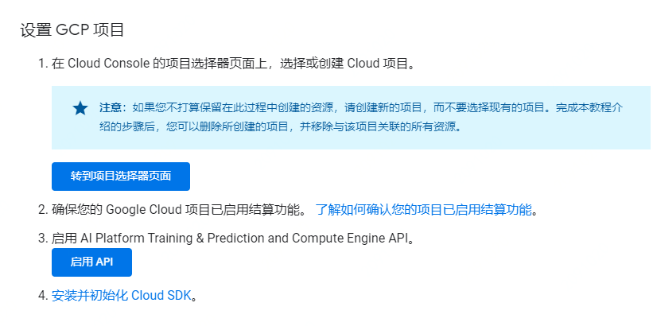
            2. 设置环境
               1. 支持macOS本地设置环境，或者在 Cloud Shell 的远程环境中设置环境（Cloud Shell 显示在 **CLOUD SHELL** 标签页面上，可在 macOS、Linux 和 Windows 系统中使用。Cloud Shell 可帮助您快速体验 AI Platform Training，但不适用于持续性的开发工作）
               2. 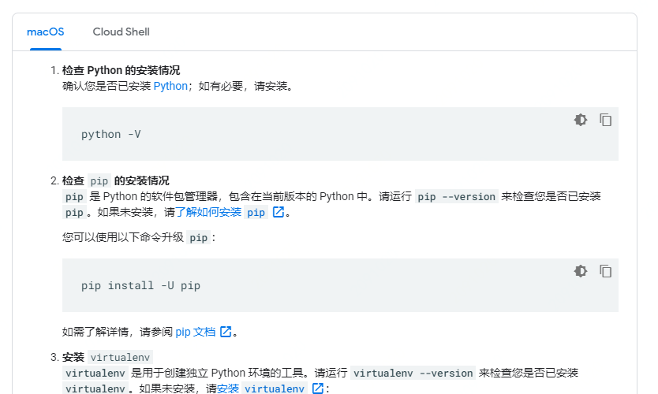

         2. 安装框架

            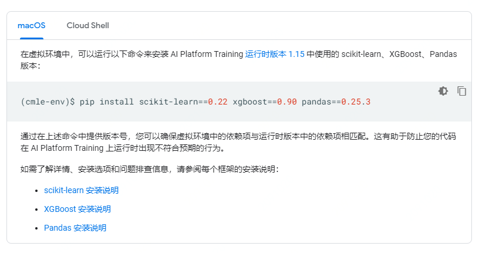

         3. 设置Cloud Storage存储分区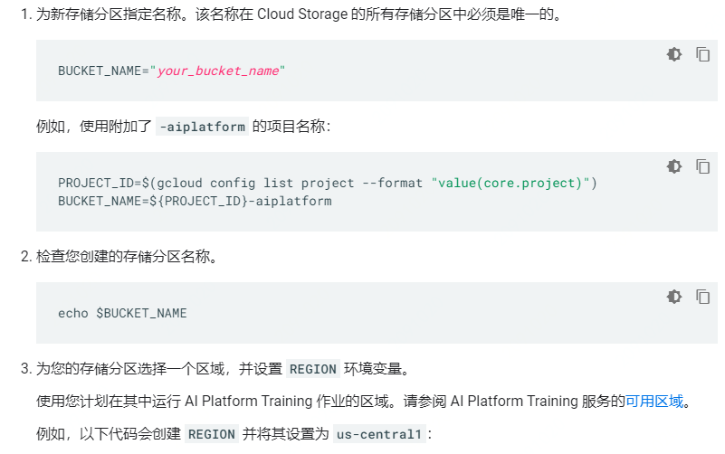

         4. 创建Python模型文件

            1. 导包设置

            2. 从Cloud Storage下载数据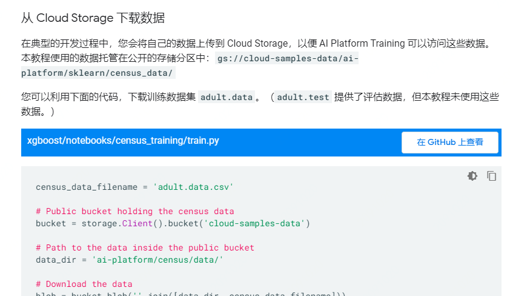

            3. 添加模型代码

               您可以利用模型训练代码，执行一些基本步骤：

               - 定义和加载数据
               - 将分类特征转换为数字特征
               - 使用 scikit-learn 流水线提取数字特征
               - 将模型导出并保存到 Cloud Storage：如果您要使用模型文件请求通过 AI Platform Prediction 进行在线预测，请确保[将模型文件命名为 `model.pkl`、`model.joblib` 或 `model.bst`](https://cloud.google.com/ai-platform/prediction/docs/exporting-for-prediction#booster)。

            4. 创建训练应用软件包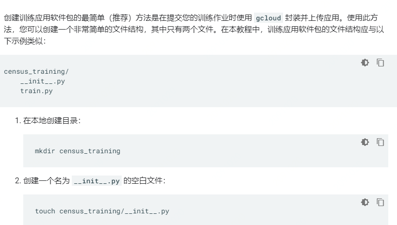

            5. 提交训练作业

               1. 使用 [`gcloud ai-platform jobs submit training`](https://cloud.google.com/sdk/gcloud/reference/ai-platform/jobs/submit/training) 提交训练作业

               2. 指定训练作业参数https://cloud.google.com/ai-platform/training/docs/training-xgboost#specify_training_job_parameters

                  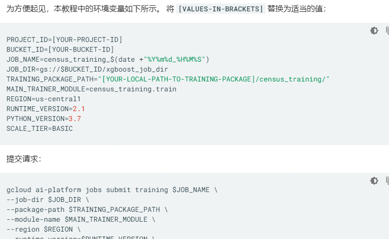

            6. 查看训练日志（可选）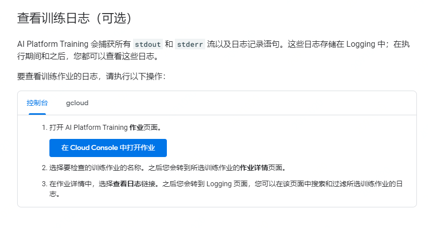

   3. 具体进行（使用Tensorflow estimator进行训练和预测）

      1. 设置并测试云环境
      2. 下载代码
      3. 在本地开发和验证训练应用
         1. 在云端运行训练应用之前，请先在本地运行。 本地环境提供高效的开发和验证工作流，让您可以快速迭代。在本地调试应用时，您也不必为云资源付费。
         2. 获取训练数据
         3. 安装依赖项
         4. 运行本地训练作业
         5. 以分布式模式运行本地训练作业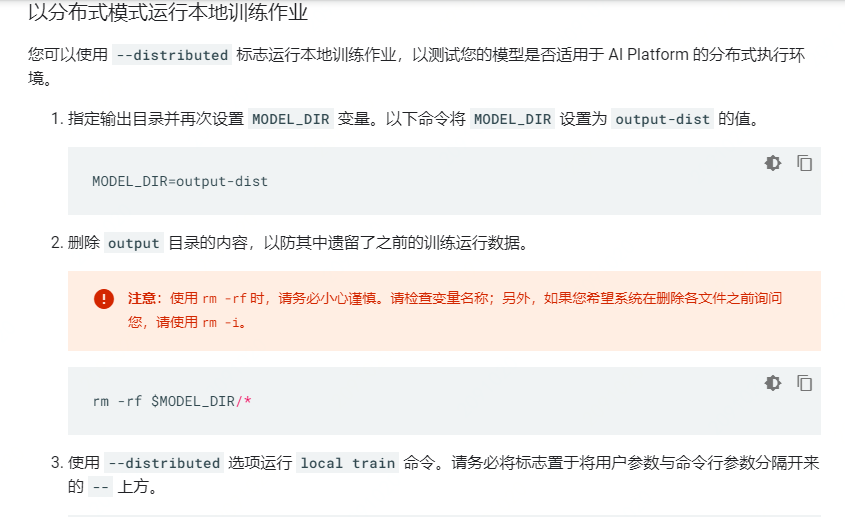
      4. 设置云存储分区
      5. 在云端运行单实例训练作业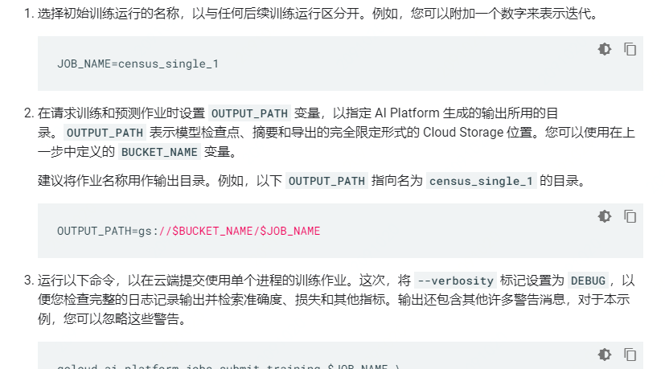
      6. 在云端运行分布式训练https://cloud.google.com/ai-platform/docs/getting-started-tensorflow-estimator#cloud-train-dist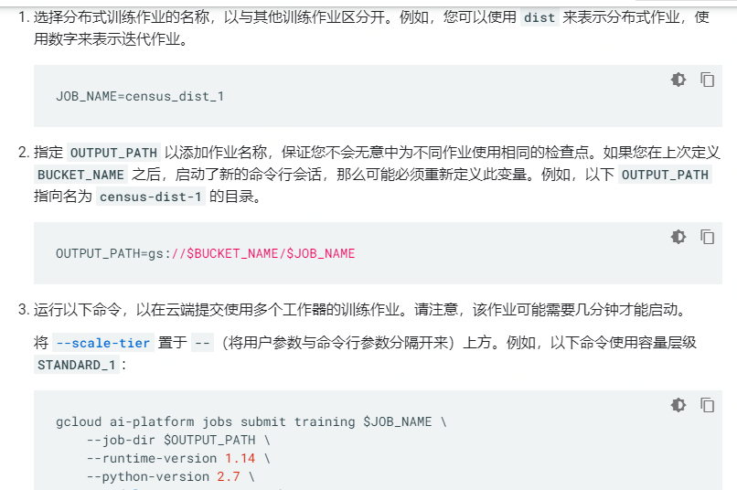
         1. 检查日志
         2. 超参数调节
      7. 部署模型进行预测

   4. 在云端使用GPU训练模型https://cloud.google.com/ai-platform/training/docs/using-gpus#adjusting_training_code_to_utilize_gpus

### 个人总结

谷歌云AI平台包含独立的训练模块文档，虽然模型训练只是AI全流程中的一环，但模型训练中是全流程的核心环节，其中包含众多知识点。AI Platform Training 将 TensorFlow、scikit-learn、XGBoost 和自定义容器的强大功能和灵活性带到了云端，让我们可以借助 Google Cloud 的资源，使用 AI Platform Training 来训练机器学习模型。谷歌AI platform training目录结构如下：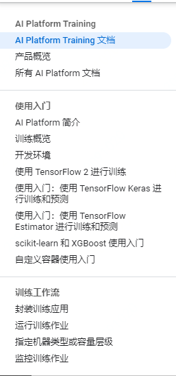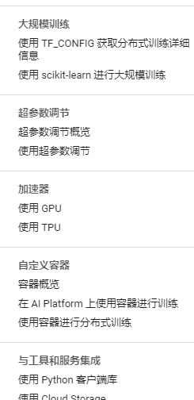

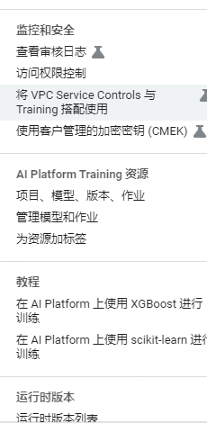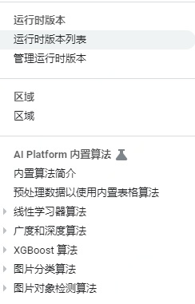

