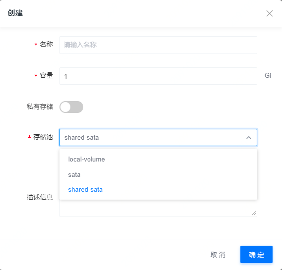
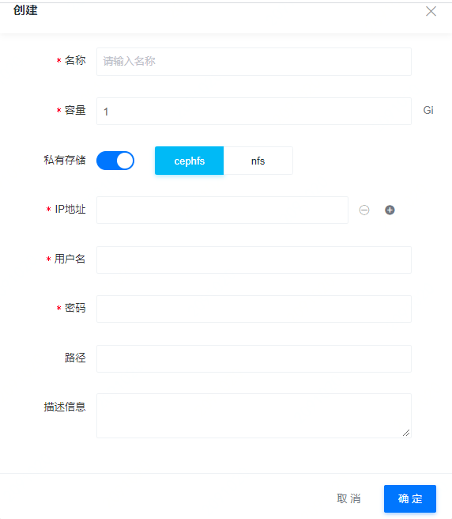
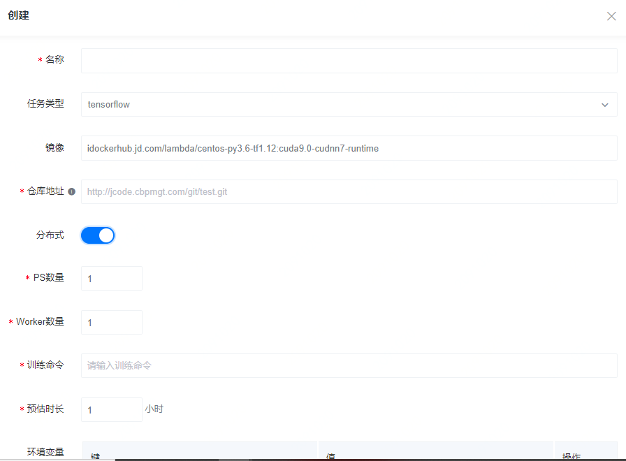
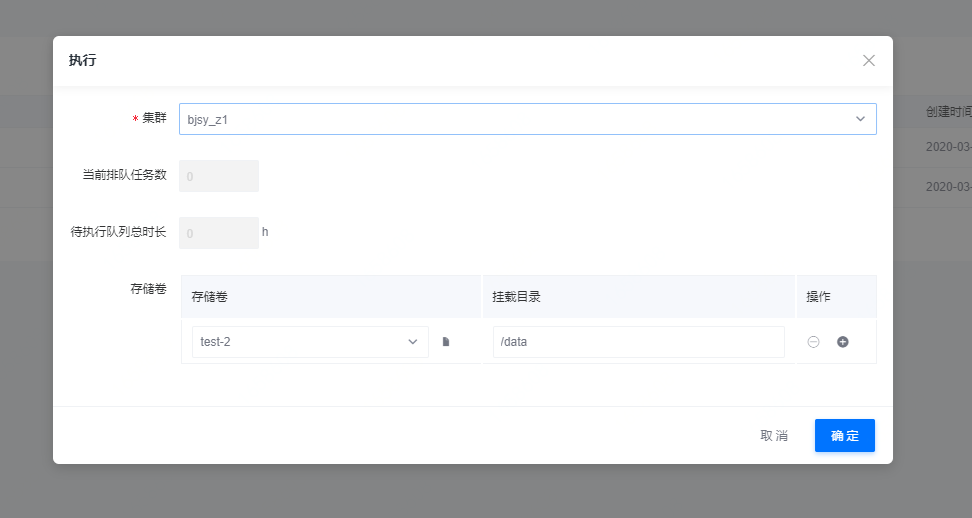
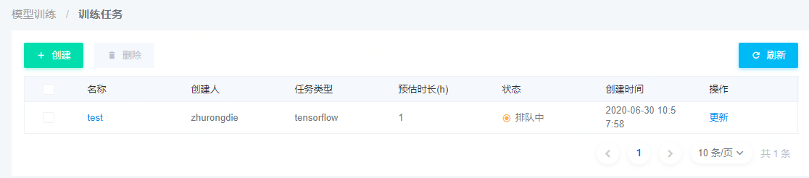
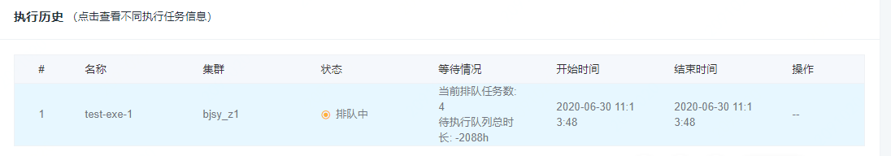

1. 数据集创建

   1. 非私有存储

      

      - 非私有存储支持三种类型的存储卷，进行分布式训练时只能选择支持多点挂载的shared-sata，允许多个容器同时读写，io性能不如私有存储卷和本地卷。**针对非私有存储的各个类别的训练任务及需求的io性能，支持多种存储卷类型满足不同需求**
      - 三种存储卷的io性能不同，**具体说明哪些任务使用哪种存储卷更优，如对数据可靠性要求不高（非私有存储），对io性能要求较高的AI应用（本地卷）**

   2. 私有存储

      

      - 私有存储支持两种文件系统，ip地址表示创建的私有存储池的地址，由于私有存储池一般存放私密数据，需要进行登录验证（模型训练创建完成后会将数据从远程gitlab仓库中导入到私有存储池指定路径）。**不方便对数据进行统一管理，只能在创建模型训练任务完成后才能从git仓库中导入数据到存储池，应该将数据集事先导入到数据存储池**
      - ==如何查看存储卷中的数据内容==

2. 训练任务创建

   

   - *选择分布式训练后指定ps及worker数量，数量选择随机且无上下限，当数量小于等于0时显示请输入正数*，**选择ps策略时给出需要建立的ps节点及worker节点个数，当选择all-reduce策略时给出需要建立的woker节点个数**
   - *训练脚本从仓库中得到，数据集也是先从仓库中下载到容器中建立的存储池再进行训练*
   - 提供预估时长选项，当时长超过时给出告警或直接结束训练
   - *根据说明文档，数据（模型文件、数据集等）还可以从对象存储服务中获取，需要事先将数据上传到对象存储服务中的，但目前的仓库地址中只支持从git中获取数据*。==环境变量中支持JRSS下载和上传文件，但是对模型训练起到的作用是什么，还是说是之后支持的功能点==

3. 训练任务执行

   

   - 训练任务执行时选择集群，需要保证该集群同数据集创建的集群一致，==部分数据只能在特定集群上执行==
   - 系统显示当前排队任务数及待执行队列总时长，从数量和时长上大致估计用户需要等待时间，避免用户一直停留在当前系统等待任务执行。**此处可以指引用户去创建Tensorboard可视化作业或者阅读相关说明等操作**

4. 控制台显示创建完成的训练任务

   

   

   - *排队时间过长，是否存在问题*，==当排队时间超过预估排队时长时，系统应该作何指示==
   - *查看创建任务时，显示的等待情况及结束时间存在问题*，==这一块的内部操作应该如何进行==
   - *模型部署操作未知*

### 总结

1. 平台优点
   1. 数据管理模块
      1. 支持容器在线扩容
      2. 提供三种适应不同任务创建需求的存储卷
   2. 控制台界面模块
      1. 提供告警机制，当排队时长或训练时长超过设定预期或者用户有其他违规操作时进行告警
2. 平台缺点
   1. 使用场景：只支持控制台界面创建训练任务，不支持交互式模型开发及创建
   2. 模型训练：支持的框架较少，对应框架下的分布式策略较陈旧（如未处理好ps策略的负载不均衡、带宽限制及资源浪费问题）
   3. 控制台界面
      1. 任务创建时的各种参数调节中存在Bug，目前仅支持从git仓库中获取训练数据
      2. 当排队时间超过预估时并没有做出进一步的指示，如告警
3. 优点延申及缺点避免
   1. 资源管理
      1. 平台资源管理
      2. 数据管理：针对用户使用数据的私密程度提供公共资源池及私有资源池服务，针对不同类型的任务提供不同类型的存储池（共享、非共享、本地等）
      3. 资源回收：提供告警机制，当资源长时间不使用时告知用户即将回收资源
   2. 使用场景
      1. 命令行界面：提供常用命令操作说明
      2. Jupyterlab开发环境：提供使用说明文档及demo来帮助用户熟悉使用流程
      3. 控制台界面：严格注意创建任务时的每个输入框中的参数是否存在界限
   3. 计算模式
      1. 支持框架：针对不同框架下的不同分布式策略，更改界面显示
      2. 参数配置：提供不同框架下不同分布式策略的参数配置说明

