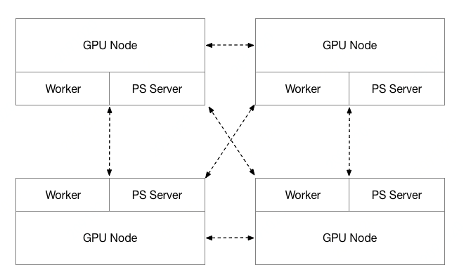
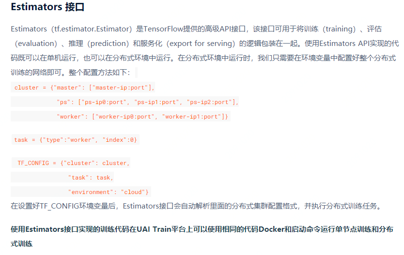
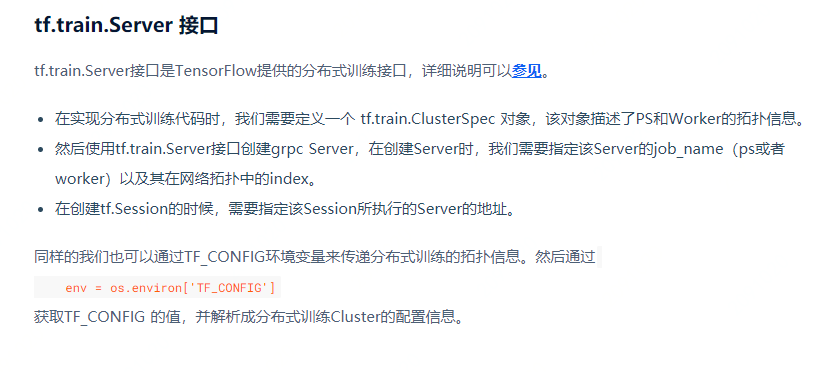
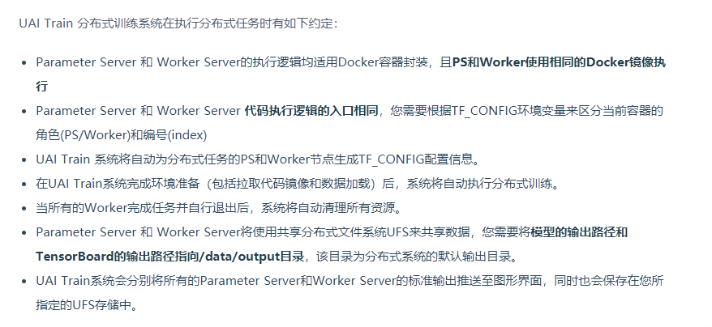
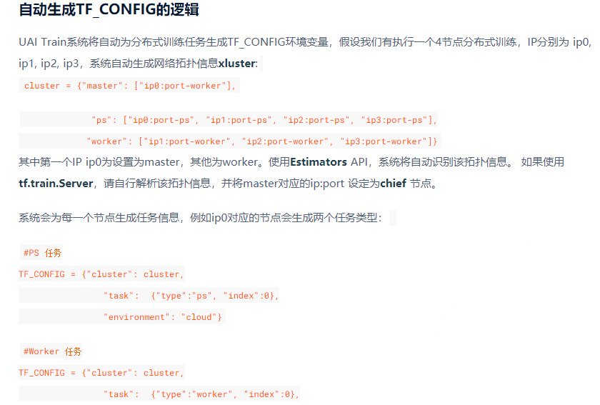
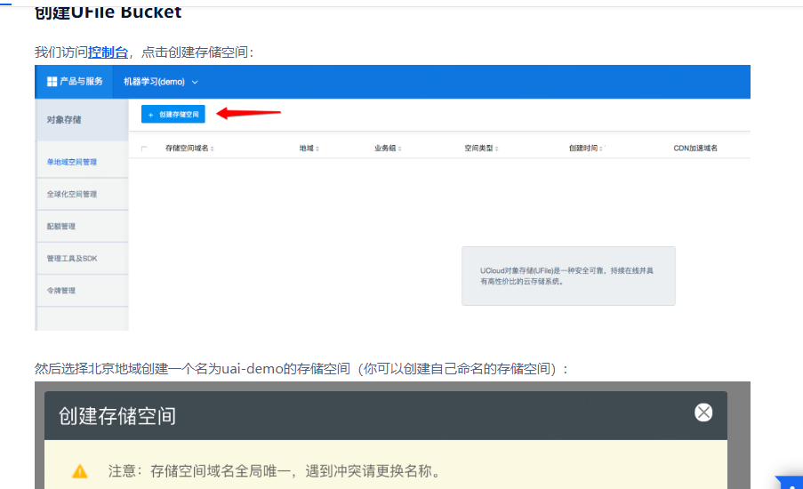
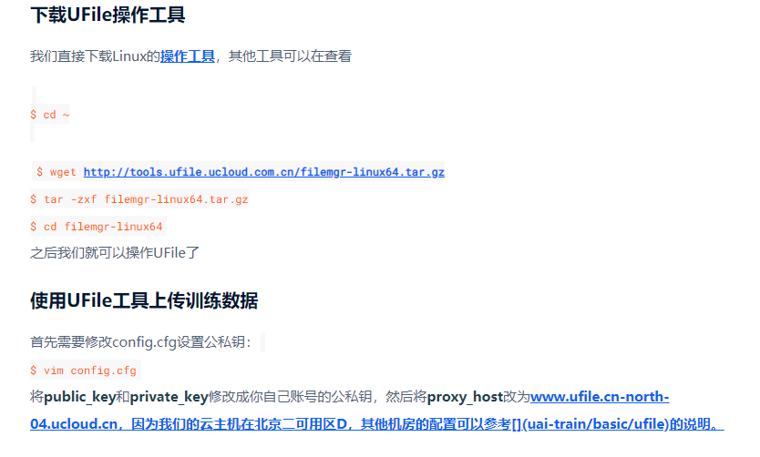
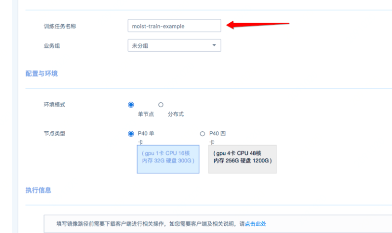

### 产品介绍

1. 逻辑实现

   1. UCloud AI Train分布式训练采用Parameter Server和Worker Server混部的方法，所有计算节点均由GPU物理云主机组成。PS 仅使用CPU进行计算，Worker Server则同时使用GPU和CPU进行计算，PS 和 Worker的比例为1:1

   2. 训练结构

      

   3. UAI Train平台支持Tensorflow和MXNet框架的分布式训练

      1. Tensorflow分布式训练
         1. Tensorflow分布式训练简介
            1. 使用estimator接口
            2. 使用tf.train.Server接口
         2. UAI Train分布式训练简介
            1. 执行分布式训练任务时的约定
            2. 自动生成TF-CONFIG逻辑
      2. MXNet分布式训练（同上：https://docs.ucloud.cn/uai-train/introduction/distributed-job/mxnet）

2. 用户使用（针对平台训练）

   1. 向UFile上传训练数据
   2. 下载UFile操作工具并使用工具上传训练数据
   3. 发起训练任务

### 优缺点

1. 优点
   1. 性能较强：支持1机4卡P40节点
   2. 支持自持自动配置Tensorflow和MXNet分布式训练集群，用户可一键发起分布式训练
   3. 操作简单
   4. 并支持GPU资源的按需租售服务，同时该平台上还可执行多机多卡的分布式训练任务
2. 缺点
   1. UAI-Train仅支持UFS作为数据的存储

### 个人疑惑

1. PS和Worker采用混合部署的方式部署，PS使用纯CPU计算，Worker使用GPU+CPU计算

### 产品化思考