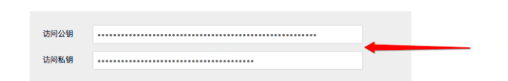

1. 控制台界面实现分布式训练

   1. 环境准备：创建云主机，安装docker，安装UAI SDK（包含训练所需数据）

   2. 创建UHub镜像仓库用于存放自己的docker镜像

      

   3. 打包镜像（使用UAI-SDK提供的打包工具打包需要训练的任务镜像）

      

      成功执行后会给出部署所需命令以及本地测试的命令

      

      - 使用命令行将训练任务所需依赖的镜像打包（如tf_tool.py）工具放入对应目录后打包训练任务镜像到镜像仓库
      - *对于每个训练任务都需要事先创建docker镜像后从本地或者远程获取训练任务所需数据，之后添加依赖的镜像打包工具对训练任务进行打包操作，会显得流程繁琐*
      - 支持本地训练的命令行操作，创建镜像结束后可以先在本地进行训练（没有GPU）（仅支持单机的本地训练）

   4. 平台训练（支持分布式）

      1. 训练任务数据上传至UFile Bucket（创建存储空间——下载操作工具——使用工具上传训练数据）

         

         - 上传数据时使用命令行或控制台实现，设置公私钥，修改代理来确保数据上传的私密性

   5. 发起训练任务

      基础配置

      

      

      

      

      - 创建训练任务时的单节点及分布式任务时的节点类型相同，不同点在于分布式给出了节点个数的选择，且个数必须在【2，4】之间（不在这个范围的数点不了）（==为什么不论是P40还是K80都最多只能支持4个节点，是否受到集群个数或之间的通讯限制==）**如果用户在训练脚本中配置的节点个数多于最大节点个数就会按照最大节点个数进行训练**
      - 获取存储池中数据及镜像仓库中的镜像时需要访问公钥和私钥，这样能保证数据传输的私密性。**区分公共资源池及私有资源池，根据数据私密类型选择存储，当存储在公共资源池中时无需进行繁琐的访问许可操作**

   6. 获取训练结果

      UFile操作界面支持对里面存放的数据进行下载或者直接在控制台上传数据到其中，同时也支持命令行下载及上传数据

      

      

2. 命令行实现分布式训练

   平台提供Python SDK实现不同框架下分布式训练任务的创建、删除、停止、查询等操作

   1. 创建训练任务

      

      返回值为JOB_ID，表示训练任务的唯一标识

   2. 执行训练任务

      

      

      单节点训练与分布式训练的主要不同在于节点类型参数和节点个数参数

   3. 查询Tensorboard URL

      

### 总结

1. 平台优点
   1. 使用场景：支持命令行、jupyterlab及控制台界面三种方式
   2. 控制台界面：创建任务界面的参数配置不存在bug，对于节点个数的选择，只能在特定范围中
2. 平台缺点
   1. 数据管理：貌似只支持从云主机的命令行将数据进行本地上传及在命令行中查看存储卷中数据内容
   2. 训练实现
      1. 支持的分布式策略是单一的自研分布式策略（带cpu和gpu的ps模式）
      2. 对原训练脚本需求较高，如果不是平台建议的实现方式则需要进行较大改动适应平台提供的分布式策略
   3. 控制台界面
      1. 当需要从私有存储池中获取数据时，需要提供公钥和私钥，虽然保证的数据私密，但会增加用户创建的时间成本，导致用户比较反感
3. 优点延申及缺点避免
   1. 资源管理
      1. 平台资源管理
      2. 数据管理：支持用户直接查看存储卷中内容
      3. 资源回收
   2. 使用场景
      1. 命令行界面：提供常用命令操作说明
      2. Jupyterlab开发环境
      3. 控制台界面：严格注意创建任务时的每个输入框中的参数是否存在界限
   3. 计算模式
      1. 支持框架：实现自研框架或自研分布式策略
      2. 参数配置

