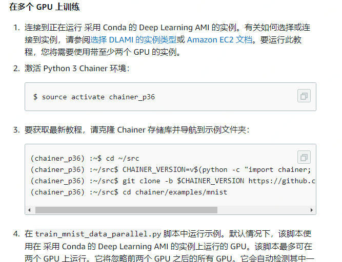
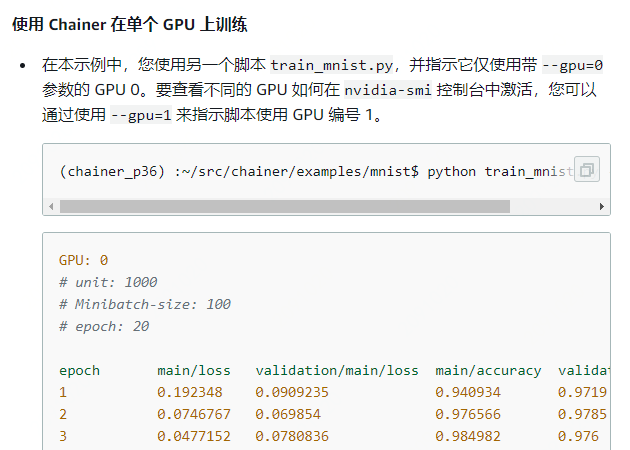
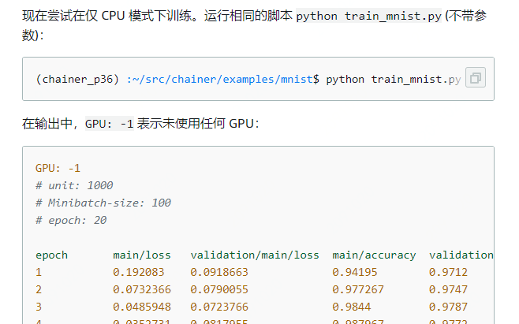
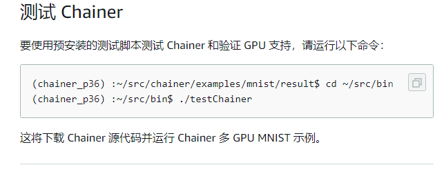

### 产品介绍

1. AWS Deep Learning AMI：AWS Deep Learning AMI (DLAMI) 是在云中进行深度学习的一站式商店。此自定义计算机实例可用于大多数 Amazon EC2 区域中的各种实例类型，从仅包含 CPU 的小型实例到最新的高性能多 GPU 实例。它预配置了 [NVIDIA CUDA](https://developer.nvidia.com/cuda-zone) 和 [NVIDIA cuDNN](https://developer.nvidia.com/cudnn) 以及最常用的深度学习框架的最新版本。
2. 使用Chainer训练模型：[Chainer](https://chainer.org/) 是一种基于 Python 的灵活框架，用于轻松直观地编写复杂的神经网络架构。利用 Chainer，您可以轻松使用多 GPU 实例进行训练。Chainer 还会自动记录结果、图表损失和精度并生成用于使用[计算图](https://docs.chainer.org/en/stable/reference/graph.html)来可视化神经网络的输出。Chainer 包含在 采用 Conda 的 Deep Learning AMI (DLAMI with Conda) 中。
   1. 使用Chainer训练模型
      1. 在多个GPU上训练
         1. ==连接实例==：连接到正在运行 采用 Conda 的 Deep Learning AMI 的实例。有关如何选择或连接到实例，请参阅[选择 DLAMI 的实例类型](https://docs.aws.amazon.com/zh_cn/dlami/latest/devguide/instance-select.html)或 [Amazon EC2 文档](http://docs.aws.amazon.com/AWSEC2/latest/UserGuide/AccessingInstances.html)。要运行此教程，您将需要使用带至少两个 GPU 的实例。
      2. 在单个GPU上训练
      3. 在CPU上训练
      4. 绘制结果
      5. 测试Chainer（？）
3. [在 Amazon EC2 上使用 AWS Deep Learning Containers 训练深度学习模型完整流程](https://aws.amazon.com/getting-started/tutorials/train-deep-learning-model-aws-ec2-containers/)