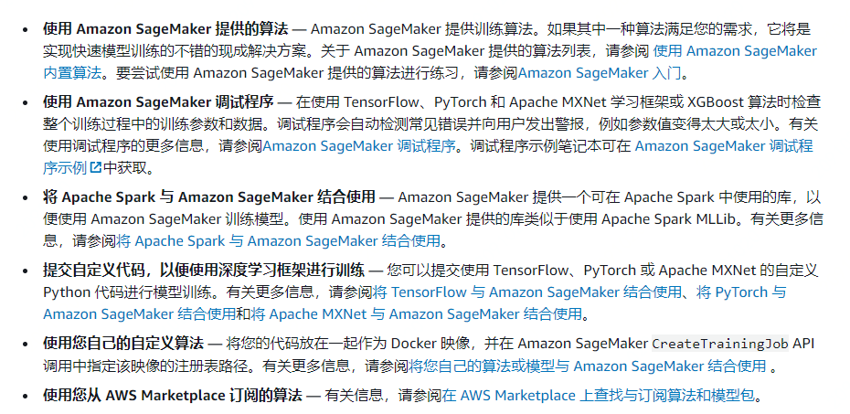
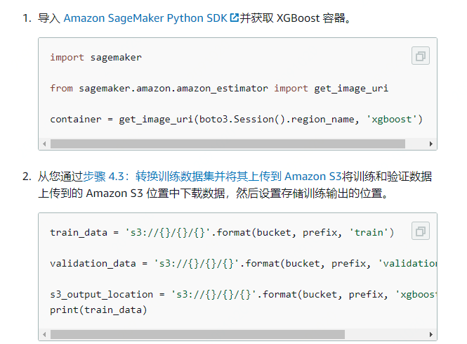
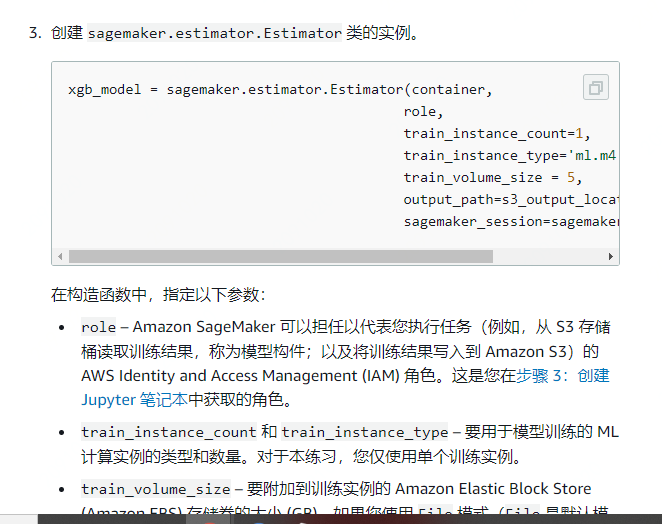
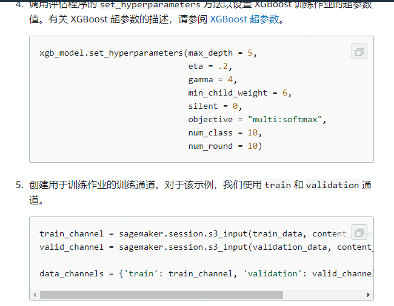
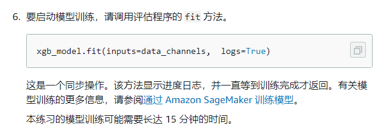
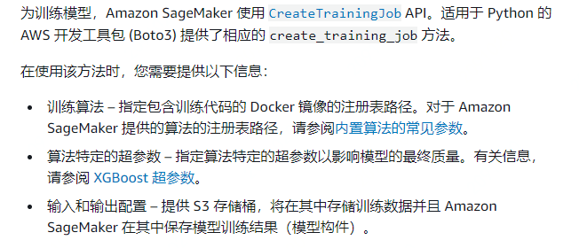

### 产品介绍

1. SageMaker介绍：Amazon SageMaker 是一项完全托管的机器学习服务。借助 Amazon SageMaker，数据科学家和开发人员可以快速、轻松地构建和训练机器学习模型，然后直接将模型部署到生产就绪托管环境中。它提供了一个集成的 Jupyter 编写 Notebook 实例，供您轻松访问数据源以便进行探索和分析，因此您无需管理服务器。此外，它还可以提供常见的机器学习算法，这些算法经过了优化，可以在分布式环境中高效处理非常大的数据。借助对自带算法和框架的原生支持，Amazon SageMaker 可以提供灵活并且适合具体工作流程的分布式训练选项可以从 Amazon SageMaker Studio 或 Amazon SageMaker 控制台中单击几下鼠标按钮以启动模型，以将该模型部署到安全且可扩展的环境中。训练和托管按使用分钟数计费，没有最低费用，也不需要前期承诺。

2. 模型训练基本流程

   1. 适用SageMaker进行训练和部署的流程图：

      https://docs.aws.amazon.com/zh_cn/sagemaker/latest/dg/images/sagemaker-architecture.png

   2. 具体流程

      1. 创建一个训练作业，该作业中包含以下内容

         - 存储训练数据的 Amazon Simple Storage Service (Amazon S3) 存储桶的 URL。
         - 您希望 Amazon SageMaker 用于模型训练的计算资源。计算资源是 Amazon SageMaker 托管的 ML 计算实例。
         - 您要存储作业输出的 S3 存储桶的 URL。
         - 存储训练代码的 Amazon Elastic Container Registry 路径。有关更多信息，请参阅[内置算法的常见参数](https://docs.aws.amazon.com/zh_cn/sagemaker/latest/dg/sagemaker-algo-docker-registry-paths.html)。

      2. 您可使用 Amazon SageMaker 控制台或 API（https://docs.aws.amazon.com/sagemaker/latest/APIReference/API_CreateTrainingJob.html） 创建训练作业

      3. 创建训练作业后，Amazon SageMaker 将启动 ML 计算实例，并使用训练代码和训练数据集来训练模型。它将生成的模型构件和其他输出保存在您为该目的指定的 S3 存储桶中。

         

      4. 训练算法选择

         1. 

3. 针对强化学习（RL）实现支持<u>多核及多实例</u>分布式训练，其适用场景如下：
   1. 单一训练实例和具有相同实例类型的多个推出实例。有关示例，请参阅 Amazon SageMaker 示例存储库中的神经网络压缩示例：https://github.com/awslabs/amazon-sagemaker-examples/tree/master/reinforcement_learning。
   2. 单一训练者实例和多个推出实例，其中用于训练和推出的实例类型是不同的。有关示例，请参阅 Amazon SageMaker 示例存储库中的 AWS DeepRacer/AWS RoboMaker 示例：https://github.com/awslabs/amazon-sagemaker-examples/tree/master/reinforcement_learning。
   3. 使用多个内核进行推出的单一训练者实例。有关示例，请参阅 Amazon SageMaker 示例存储库中的 Roboschool 示例：https://github.com/awslabs/amazon-sagemaker-examples/tree/master/reinforcement_learning。如果模拟环境是轻量型的且可以在单一线程上运行，这就很有用。
   4. 多个实例用于训练和推出。有关示例，请参阅 Amazon SageMaker 示例存储库中的 Roboschool 示例：https://github.com/awslabs/amazon-sagemaker-examples/tree/master/reinforcement_learning。

4. 训练模型使用流程（使用 Amazon SageMaker Studio 笔记本）

   1. 选择训练算法https://docs.aws.amazon.com/zh_cn/sagemaker/latest/dg/algos.html

   2. 创建并运行训练作业： **使用[Amazon SageMaker Python SDK](https://sagemaker.readthedocs.io/)** ，其包含 `sagemaker.estimator.Estimator` 评估程序

      1. 运行模型训练作业

         

         

         

         

   3. 创建并训练作业**（适用于 Python 的 AWS 开发工具包 (Boto3)）**

      

	### 个人总结
	
	SageMaker针对机器学习算法做模型训练，内置多种算法，上层封装自己的estimator，支持对多种机器学习算法做参数配置，配置运行算法的实例数量进行分布式训练

​	

