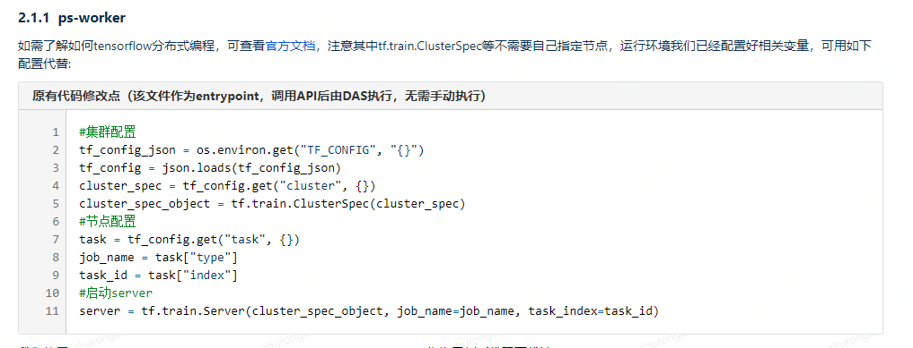

### 产品介绍

1. DAS平台支持提交分布式训练任务，来提高大规模模型训练的速度。可通过DAS API直接提交TensorFlow/Pytorch/XGBoost分布式训练任务
2. 提供服务
   1. Tensorflow分布式训练
      1. ps-worker模式
      
         
      
      2. all-reduce模式
      
   2. pytorch分布式训练
      
      1. master-worker模式
         1. cpu示例
         2. gpu示例
      
   3. XGBoost分布式训练
      
      1. master-worker模式
         1. cpu示例
         2. gpu示例
      
   4. 任务查看：默认情况下，对于Tensorlow分布式任务，会在开发环境里输出chief或者worker-0的日志；对于Pytorch分布式任务，输出master日志。但由于分布式训练持续时间较长，如果网络中断或者不小心关闭了notebook，再次进入开发环境时仍然可以通过DAS提供的api获取任务的状态以及相应实例的日志。

   5. 任务管理面板：可以通过DAS首页的分布式任务页面查看各分布式任务的日志，性能监控，以及管理分布式任务。其中，tensorflow任务以 **-tf** 结尾，pytorch任务以 **-pt** 结尾，可以通过在搜索框输入关键词进行过滤。

   6. 任务报错处理
3. 用户使用
   1. 在平台提供的notebook中修改代码，使用平台提供的das API进行配置更改以适应不同框架的分布式训练
   2. 任务查看
   3. 任务管理
      - 查看日志
      - 性能监控
      - 管理分布式任务
      - 任务报错处理

### 个人总结

以上用户使用流程只是通过分布式训练文档所给汇总提取得到，对于全流程如何使用并没有完整用例参考，此外，该平台如何使用并没有明确的文档告知

### 

