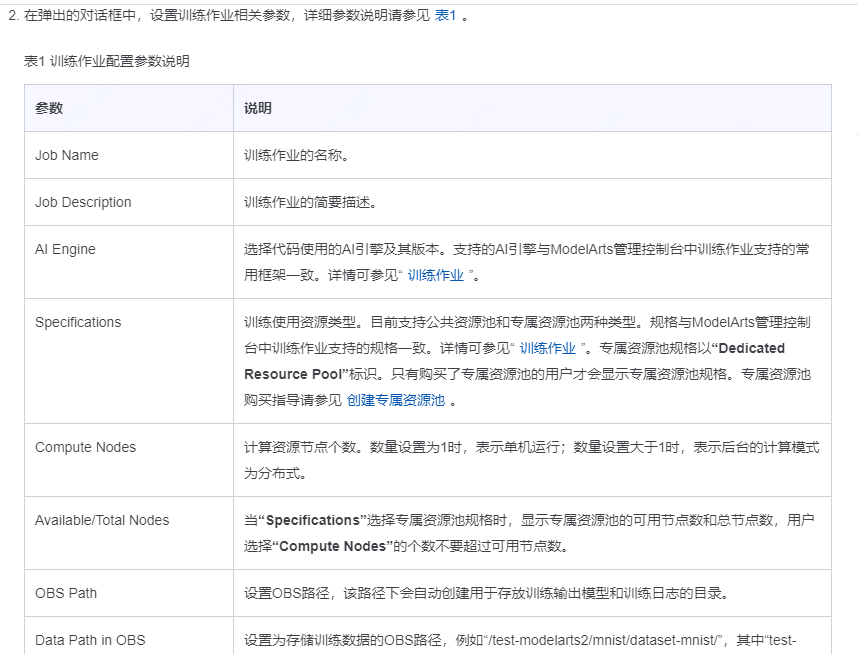

### 产品介绍

1. 逻辑实现
   1. 通过硬件、软件和算法进行协同优化来实现训练加速
      1. 硬件角度：考虑系统整体计算规格、网络带宽、高速缓存、功耗、散热等因素，考虑计算和通信的吞吐量问题，实现计算和通信时延的隐藏
      2. 软件角度：结合高性能硬件特性，充分利用硬件高速网络实现高带宽分布式通信，实现高效的数据集本地数据缓存技术，通过训练调优算法，如混合并行，梯度压缩、卷积加速等技术，实现分布式训练系统软硬件端到端的高效协同优化，实现多机多卡分布式环境下训练加速
      3. 算法角度：
         1. 基于机器学习算法及强化学习的模型训练自动超参调优
         2. 将分布式加速层抽象出来，提供自研的分布式训练加速框架MoXing
            1. MoXing框架结构
            2. MoXing所起作用：在数据读取和预处理方面，MoXing通过利用多级并发输入流水线使得数据IO不会成为瓶颈；在模型计算方面，MoXing对上层模型提供半精度和单精度组成的混合精度计算，通过自适应的尺度缩放减小由于精度计算带来的损失；在超参调优方面，采用动态超参策略（如momentum、batch size等）使得模型收敛所需epoch个数降到最低；在底层优化方面，MoXing与底层华为自研服务器和通信计算库相结合，使得分布式加速进一步提升
   
2. 用户使用（模型训练）：使用PyCharm ToolKit工具，可以快速将本地开发的训练代码，提交至ModelArts公有云侧进行训练。ModelArts管理控制台的创建训练操作指导请参见[训练作业](https://support.huaweicloud.com/engineers-modelarts/modelarts_23_0046.html)

   1. 前提条件

      1. 在本地pycharm中已有训练代码工程
      2. 训练作业使用的数据已经上传到OBS，且OBS与ModelArts在同一区域

   2. 配置训练作业参数

      1. 

      2. 

         

      3. 

3. 使用流程（全流程）

   1. 准备数据
      1. 数据集上传至OBS
   2. 训练模型
      1. 在模型训练的过程中或者完成后，可以通过创建可视化作业查看一些参数的统计信息
   3. 部署模型

4. 验证模型

   ```mermaid
   graph TD
   A[准备环境]-->B[创建OBS桶和目录]
   B -->C[拷贝数据集到OBS桶]
   C -->D[创建训练作业]
   D -->E[模型导入]
   E -->F[模型部署]
   F -->G[发起检测]
   ```

### 优缺点

1. 优点
   1. 自动混合精度训练（充分发挥硬件计算能力）
   2. 动态超参调整技术（加速模型收敛时间）
   3. 自建分布式高性能通信库
   4. 分布式数据、模型混合并行
   5. 训练数据压缩、多级缓存
2. 缺点

### 个人疑惑

1. 衡量分布式深度学习加速性能的指标
   1. 吞吐量
   2. 收敛时间

### 产品化思考

1. 模型训练
   1. 资源池介绍
   2. 数据集要求
      1. 图像领域
      2. 文本领域
   3. 加速算法
```


```