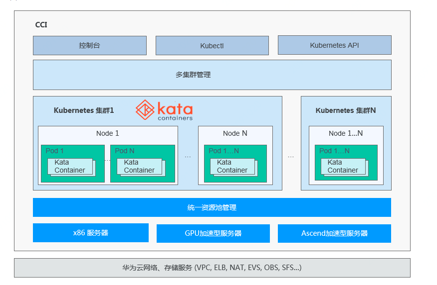
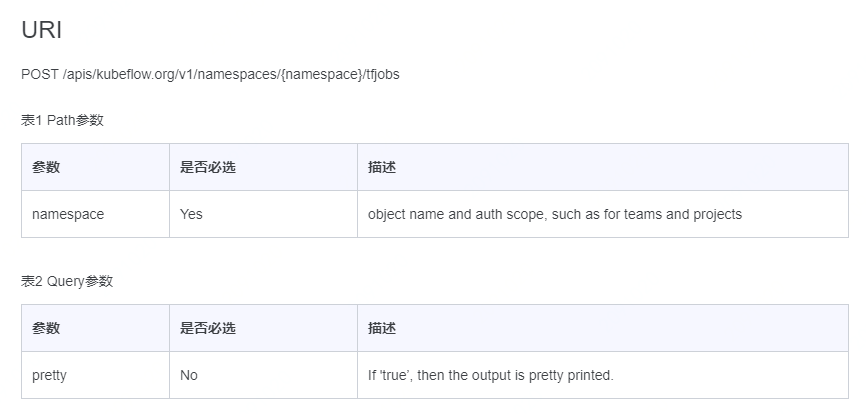
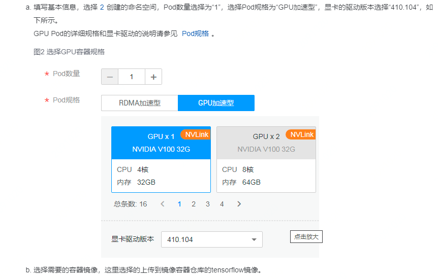

### 产品介绍

1. 逻辑实现
   1. 无需创建和管理服务器集群即可直接运行容器

   2. 一站式容器生命周期管理，支持多种类型计算资源（CPU/GPU/自研芯片），支持多种网络访问方式

   3. 产品架构

   

2. 用户使用（以TF Job为例）

   1. 依据提供的Kubernetes API 中的TF Job命令，实现Tensorflow的单机或分布式训练
   
   2. 请求URL，设置参数
   
      
   
3. 使用tensorflow训练神经网络全流程https://support.huaweicloud.com/bestpractice-cci/cci_04_0008.html

### 优缺点

1. 优点
   1. 高性能AI容器，对接AI分布式训练框架
   2. 随启随用：业界领先的 Serverless Container 架构，用户无需创建 Kubernetes 服务器集群，直接使用控制台、kubectl、Kubernetes API创建容器
2. 缺点
   1. 命令行方式调用分布式训练服务，用户界面不良好

### 个人疑惑

API与前端接口实现分布式训练

### 产品化思考

1. 提供两种方式实现分布式训练

