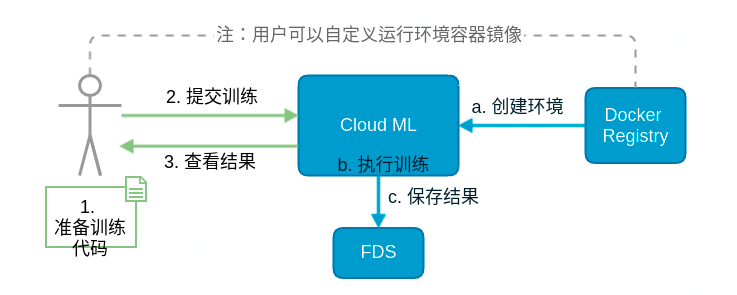

### 产品介绍

1. 逻辑实现

   1. 在多个节点启动Python脚本组成分布式计算集群
   2. 支持标准的分布式TensorFlow应用，用户只需编写对应的Python脚本即可提交运行
   3. Cloud-ML要求用户通过DISTRIBUTED_CONFIG或TF_CONFIG(Cloud-ML原先只支持tensorflow分布式时，使用TF_CONFIG这个环境变量传递分布式参数，当前仍保留，后期会统一为DISTRIBUTED_CONFIG)这个环境变量传入集群和节点的信息
   4. 如果使用Xiaomi Cloud-ML，只需要把Python代码打包，然后运行时传入 `-D`，之后根据提示输入task type的名称、数量、资源及定制参数等信息

2. 用户使用

   

   ### 个人总结
   
   仅限于理论上集群布置实现分布式训练，具体案例以及界面实现并没有涉及
   
   