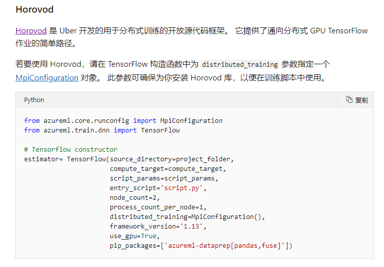
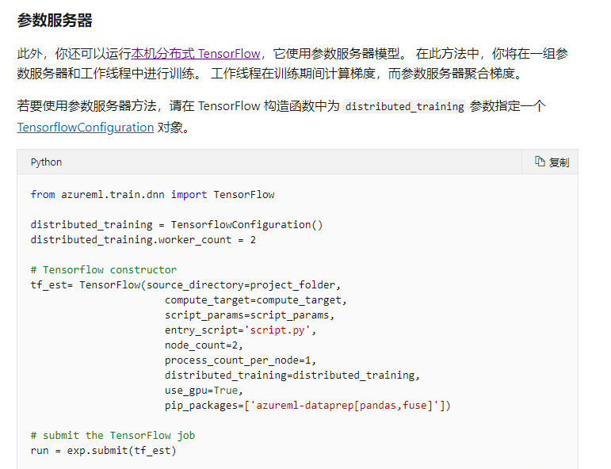
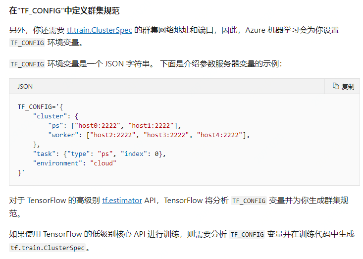
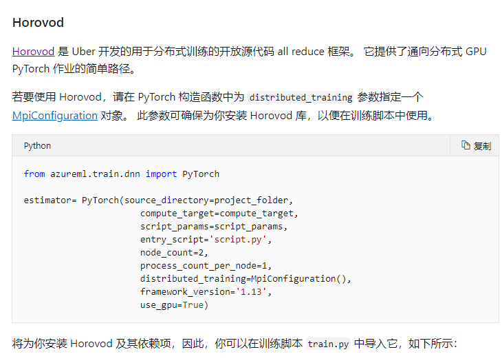
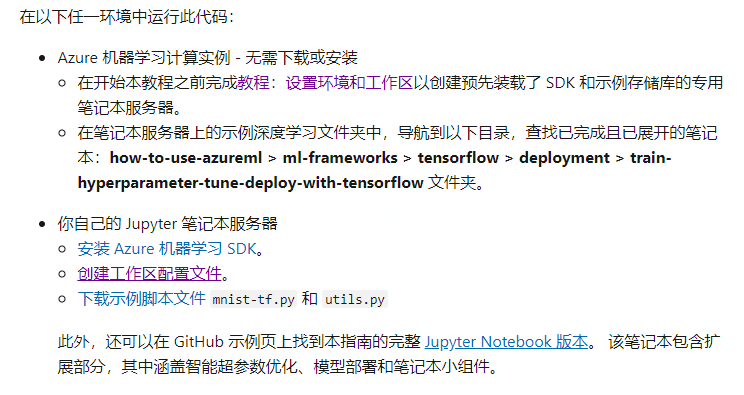
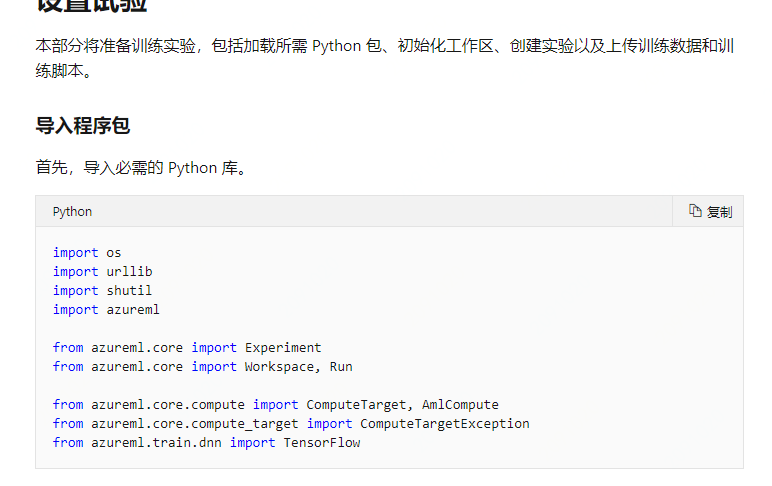
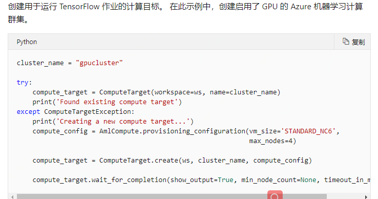
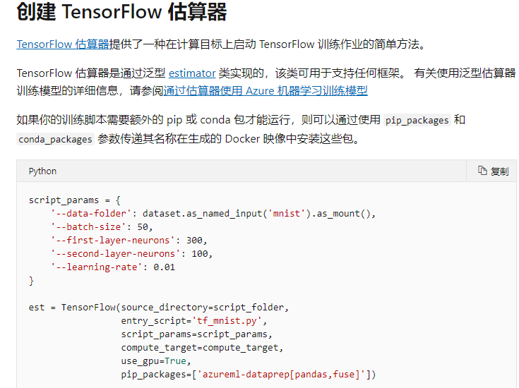

### 产品介绍

1.  Azure：是一种基于云的环境，你可以使用它来训练、部署、自动化、管理和跟踪 ML 模型

2. 分布式训练分为两种主要类型：数据并行和模型并行。 对于深度学习模型的分布式训练， [Python 中的 AZURE 机器学习 SDK](https://docs.microsoft.com/zh-cn/python/api/overview/azure/ml/intro?view=azure-ml-py)支持与常用框架、PyTorch 和 TensorFlow 的集成。 这两个框架都利用了数据并行来实现分布式训练，并可以利用[horovod](https://horovod.readthedocs.io/en/latest/summary_include.html)来优化计算速度。对于不需要分布式培训的 ML 模型，请参阅使用[Azure 机器学习训练模型](https://docs.microsoft.com/zh-cn/azure/machine-learning/concept-train-machine-learning-model#python-sdk)，了解使用 Python SDK 训练模型的不同方式

3. Azure 机器学习支持 TensorFlow 中的两种分布式训练方法：
   1. 使用 [Horovod](https://github.com/uber/horovod) 框架进行[基于 MPI](https://www.open-mpi.org/) 的分布式训练

   2. 使用参数服务器方法进行本机[分布式 TensorFlow]

      

4. 对pytorch，支持使用 [Horovod](https://github.com/uber/horovod) 框架进行[基于 MPI](https://www.open-mpi.org/) 的分布式训练

   

5. 用户使用流程（全流程）https://docs.microsoft.com/zh-cn/azure/machine-learning/how-to-train-tensorflow#create-a-compute-target

   1. 准备条件
   2. 设置实验
   3. 创建计算目标
   4. 创建tensorflow估算器
   5. 提交运行

### 个人总结

理论知识及使用流程都比较杂乱

