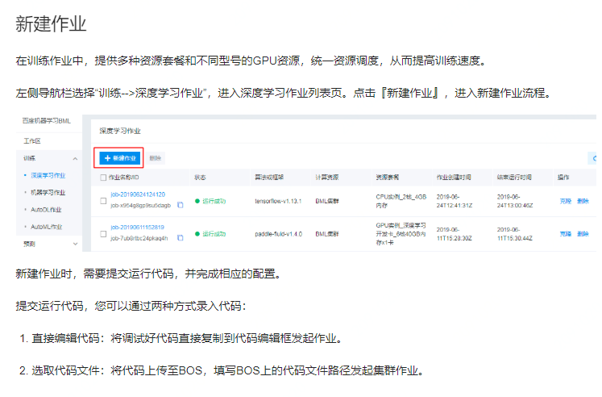
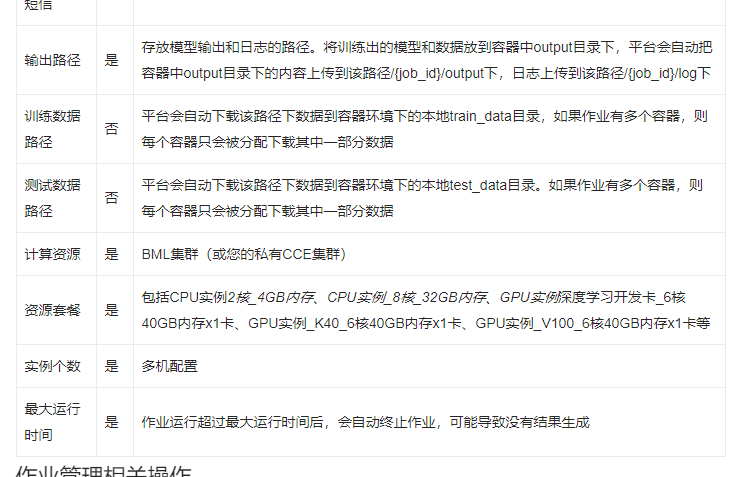
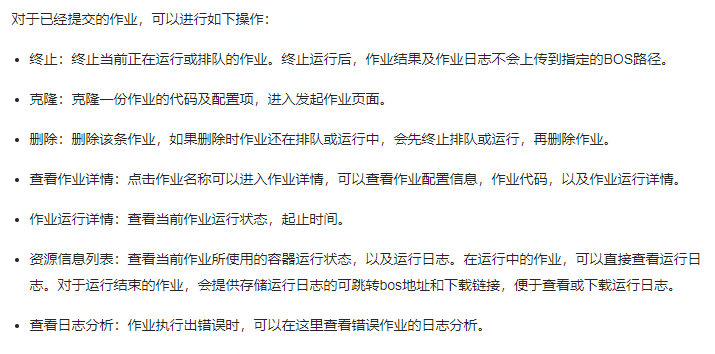
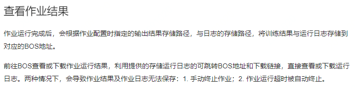

### 产品介绍

1. BML：百度机器学习BML(Baidu Machine Learning)是一款全功能AI开发平台，提供一站式人工智能模型建设功能服务集。面向用户同时提供机器学习和深度学习环境，实现从数据源管理、数据标注，数据集存储、数据预处理、模型训练生产到模型管理、预测推理服务管理、全服务监控等AI建设全工作周期的服务能力。**平台提供了高性能的集群训练环境**，多种主流算法框架与海量模型案例，以及操作便捷的预测服务工具。用户可以专注于模型与算法本身，并得到优质的模型与预测效
2. 逻辑实现：集成了多种开源的深度学习框架。用户可以使用不同的框架，编写代码进行多轮训练和迭代，并将产生的模型和各种数据上传到BOS存储上
3. 用户使用
   1. 新建作业
   2. 作业配置项
   3. 作业管理相关操作
   4. 查看作业结果

### 个人总结

BML提供高性能集群环境实现分布式训练，对于具体实现方式并未在文档中交代