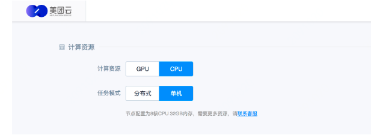

### 产品介绍

1. 逻辑实现
   1. 实现Tensorflow的多机多卡分布式训练（实现数据并行中的同步与异步参数更新方法）
      1. 使用PS通信方式
      2. 实现流程
         1. 将模型实现封装成函数
         2. 将数据分成GPU数量的份数
         3. 在每个GPU下，进行一次模型forward计算，使用优化器计算梯度
         4. reduce每个GPU下的梯度，将梯度传入到分布式中的优化器中
      
   2. 一般TensorFlow的程序，包括TensorFlow的官方文档都对PS采用了server.join的处理方式，但是这种方式处理有一个问题：PS无法随着训练的结束而自动停止，需要手动kill，很麻烦。 如果想在DLS运行，则无法做到手动kill PS的，因此需要对PS进行一种特殊实现，保证在各个worker退出后，PS会自动退出，结束训练任务。

      解决方法：采用队列通信的方式同步。

      1. 为PS和每个worker创建一个队列
      2. PS在server创建后，对队列进行worker数量的dequeue操作
      3. 每个worker在完成后，对队列进行一次enqueue操作

2. 用户使用

   1. 创建项目

   2. 代码与数据上传

   3. 创建任务并启动

   4. 计算资源配置

      1. 计算资源：CPU/GPU
   2. 任务模式：分布式/单机
   
   
   
5. 输入输出配置
   
   1. 代码文件位置
      2. 训练数据位置
   3. 模型保存地址
   
   6. 任务启动与运行
   
   7. 查看任务详情
   
   8. 任务日志查看

### 优缺点

1. 优点
2. 缺点

### 个人疑惑

### 产品化思考

