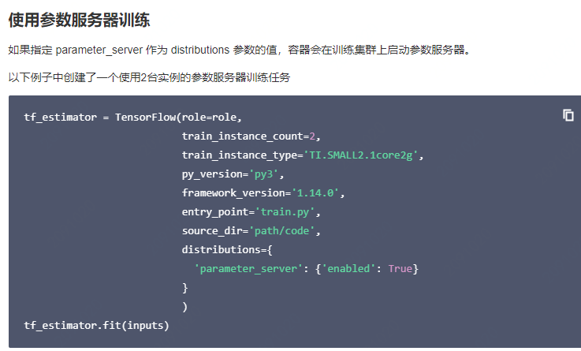
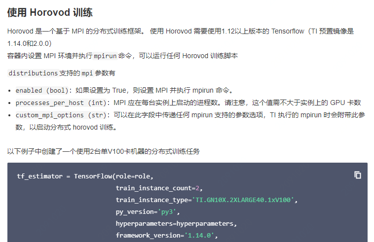
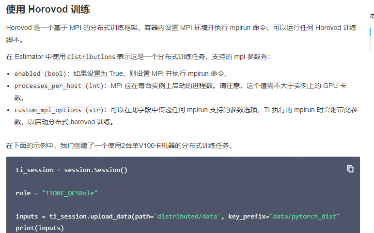
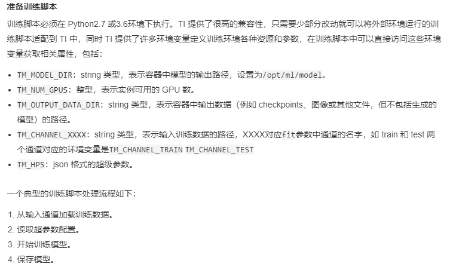
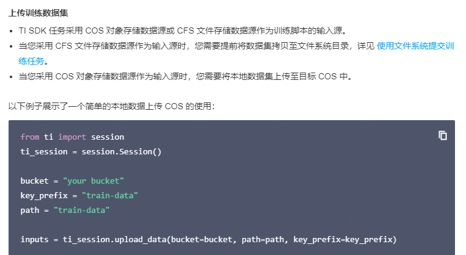
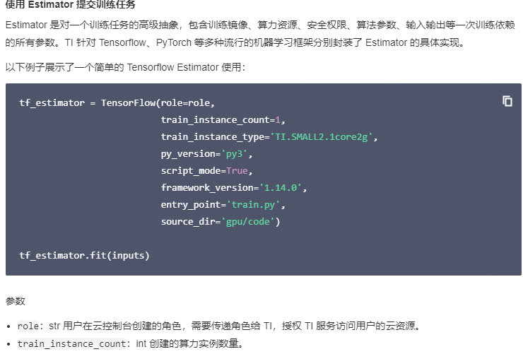
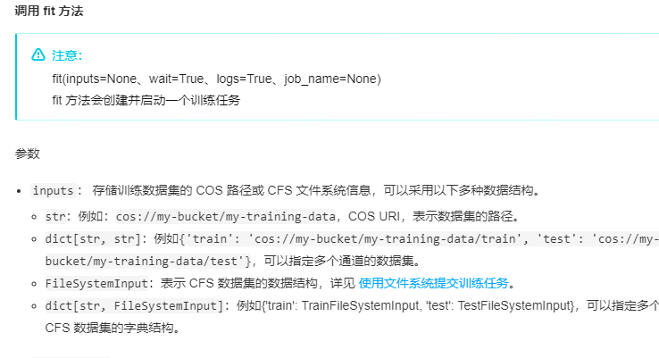

### 产品介绍

1. 理论层
   1. TI SDK是腾讯云智能钛机器学习平台TI-ONE提供的开源软件包，让用户可以通过代码向TI-ONE提交机器学习和深度学习的训练任务
   2. TI SDK支持对Tensorflow和Pytorch的分布式训练
      1. 实现Tensorflow分布式训练
         1. 使用参数服务器训练
         2. 使用Horovod训练（？）
      2. 实现Pytorch分布式训练
         1. 使用Horovod训练
2. 使用层（使用TI SDK训练模型）
   1. 操作场景
      1. 在notebook中使用
      2. 在本地环境中使用
   2. TI SDK 使用以下几个核心类实现 TI 的模型训练
      - Estimators： 对训练任务的抽象。
      - Session：使用 TI 资源的方法集合。
   3. 操作步骤
      1. 准备训练脚本
      2. 上传训练数据集
      3. 构造estimator：Estimator 是对一个训练任务的高级抽象，包含训练镜像、算力资源、安全权限、算法参数、输入输出等一次训练依赖的所有参数。TI 针对 Tensorflow、PyTorch 等多种流行的机器学习框架分别封装了 Estimator 的具体实现。
      4. 调用estimator的fit方法

### 优缺点

1. 优点
   1. 内置深度优化的Tensorflow和Pytorch等多种流行的深度学习框架，提供单机和多机多卡训练能力
   2. 对接腾讯云上服务
   3. 通过API/SDK方式使用机器学习平台能力，支持CPU和GPU等多种算力类型
2. 缺点

### 个人疑惑

### 产品化思考

平台可以针对各大主流深度学习框架或自研框架分别封装estimator的具体实现