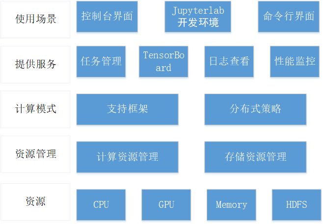
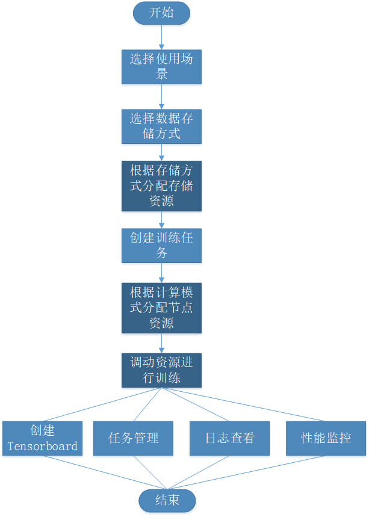

1. 整体训练结构

   

2. 结构各部分解释

   1. 使用场景：表示在用户在什么场景下创建训练任务
   2. 提供服务
      1. 任务管理：提供任务创建、更新、停止、删除操作
      2. TensorBoard：针对Tensorflow提供模型训练可视化服务
      3. 日志查看：针对训练完成的任务进行每个工作节点的日志查看
      4. 性能监控：查看计算资源及存储资源的使用情况
   3. 计算模式
      1. 支持框架：常见深度学习框架
      2. 分布式策略：包括并行模式（模型并行/数据并行），调度模式（集中式/去中心化），更新策略（同步更新/异步更新）
   4. 资源管理
      1. 计算资源管理：Yarn或K8s对CPU或GPU资源进行调度
      2. 存储资源管理
         1. 内部存储系统（HDFS）：获取其中训练样本
         2. 外部存储系统（对象存储服务）：保证数据的持久化存储和可扩展性
            1. 私有存储：Ceph（单机）\CephFS（分布式）保证数据私密
            2. 非私有存储（公共资源池）：sata（单机）\shared_sata（分布式）\local_volume（io性能最好）

3. 使用流程

   选择使用场景——选择数据存储方式——根据存储方式分配存储资源——创建训练任务（选择计算模式、选择数据输入、模型输出路径）——根据计算模式分配节点资源——调动资源进行训练——创建TensorBoard/进行任务管理/日志查看/性能监控（深蓝色表示系统操作，其余表示用户操作）

   

