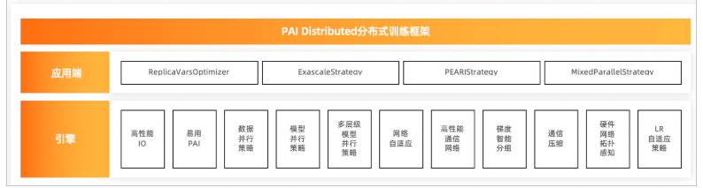
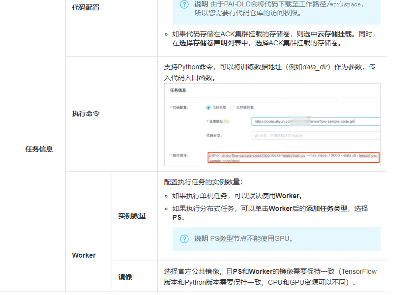
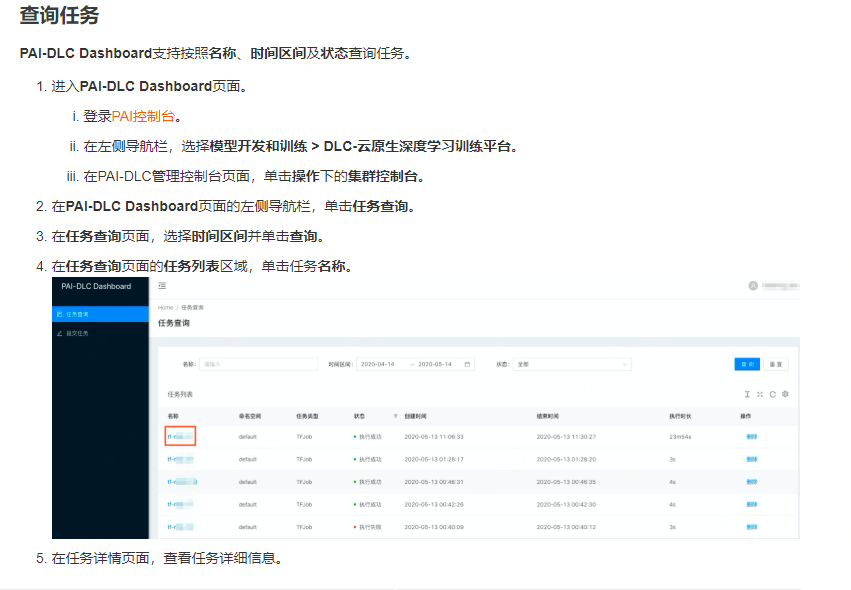
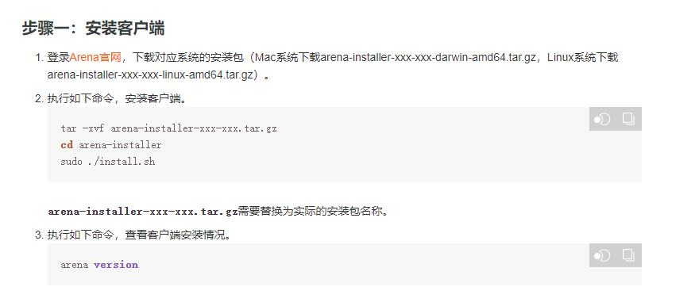
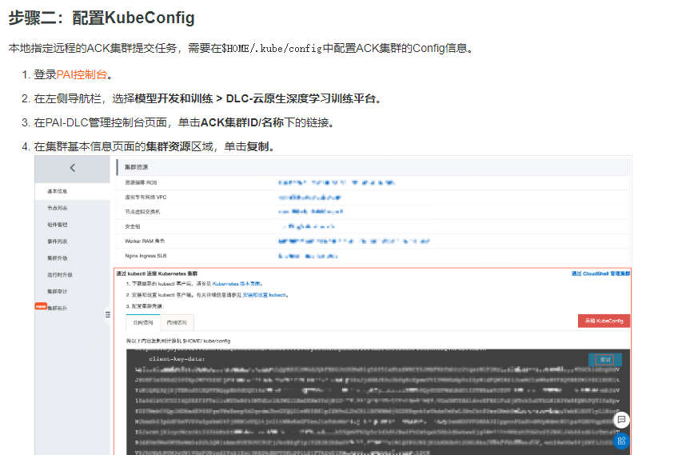
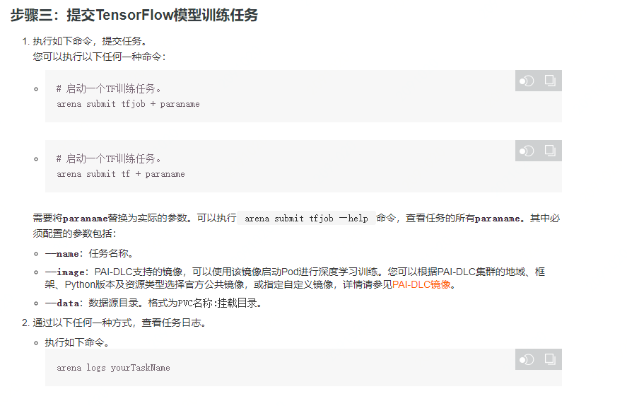
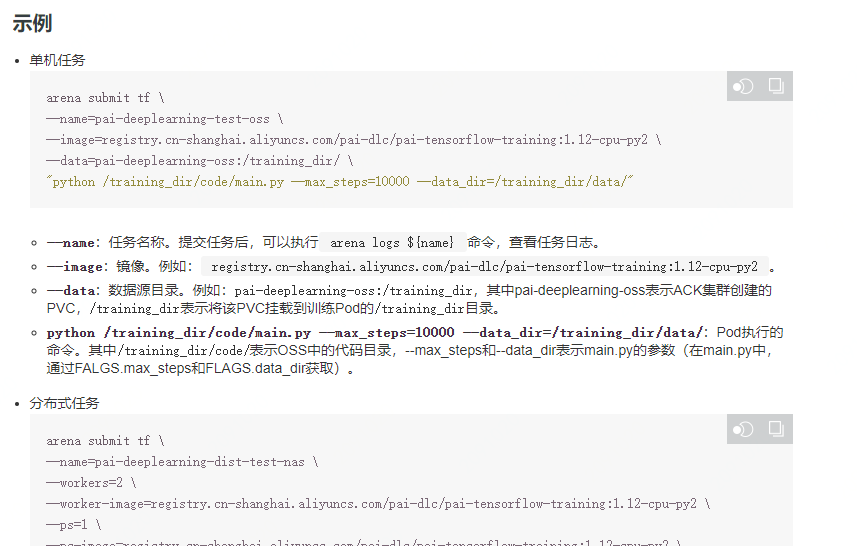
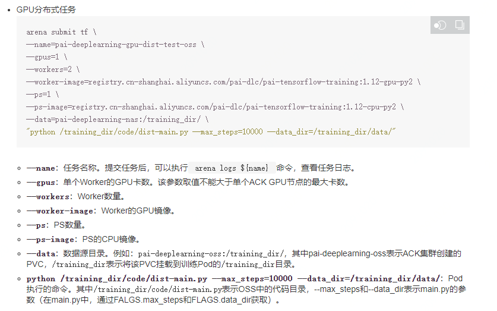

### 产品介绍

1. 逻辑实现

   1. PAI-DLC是基于阿里容器服务ACK的深度学习训练平台，提供深度学习训练环境

   2. PAI-DLC融合PAI在深度学习上的框架和网络优化技术，实现近线性扩展的分布式计算能力

   3. 分布式训练框架

      

2. 用户使用

   1. 使用PAI-DLC Dashboard管理任务（？）

      1. 前提条件：添加ACK集群

      2. 背景信息：目前，PAI-DLC Dashboard仅支持管理官方公共镜像的TensorFlow类型任务，管理其他类型的任务需要通过Arena方式，详情请参见[Arena官方文档](https://github.com/kubeflow/arena)。

      3. 提交任务：

         1. 进入**PAI-DLC Dashboard**页面。

         2. 在**PAI-DLC Dashboard**页面的左侧导航栏，单击**提交任务**。

         3. 在提交任务界面配置必选参数（名称、类型、代码配置、执行命令、worker等），配置可选参数

            

            

      4. 查询任务

   2. 使用Arena管理任务

      1. 安装客户端

      2. 配置KuberConfig

      3. 提交模型训练任务

         

         

      

### 优缺点

1. 优点
   1. 训练性能强大：128卡的并行计算加速比达到了100以上。在千万图像数据集、数十万分类场景下，训练性能是开源框架的8倍以上。针对互联网行业的搜索、推荐、广告和信息流等场景，PAI-DLC支持千亿样本、百亿特征， 数千节点并行训练的能力，训练性能是开源框架的5倍以上
   2. 支持数据并行、模型并行及混合并行的分布式方案
   3. 支持通过Arena等方式提交、管理及查看任务
2. 缺点

### 个人疑惑

1. 不同分布式方案的适用场景如何选择

### 产品化思考

1. 提供分布式方案选择
   1. 数据并行模式
   2. 模型并行模式
   3. 混合并行模式

